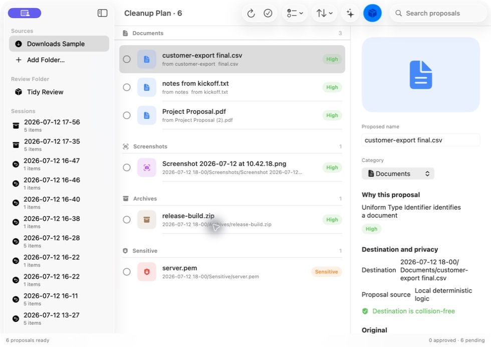

# Desktop Cleaner

Desktop Cleaner is a native macOS utility for safely organizing files accumulated in Desktop, Downloads, and explicitly selected folders. It creates a reviewable plan before anything moves, stages only approved files in a visible review folder, and can undo a complete session.

> Nothing moves until the user approves it, nothing is deleted automatically, and every staged cleanup session can be undone.



## Download and install

Download the latest notarized universal macOS build from [GitHub Releases](https://github.com/shortcutchris/desktop-download-cleaner/releases/latest/download/DesktopCleaner-1.1.2.zip).

1. Download and expand `DesktopCleaner-1.1.2.zip`.
2. Move **Desktop Cleaner.app** into `/Applications`.
3. Launch the app, choose Desktop, Downloads, or another folder, and review the read-only cleanup plan before approving anything.

The release is signed with Developer ID, notarized by Apple, stapled for offline Gatekeeper verification, and includes both Apple Silicon and Intel code. The release page also provides a SHA-256 checksum and a signed Sparkle appcast. Use **Settings → Updates** to check manually or opt in to automatic checks; automatic checks remain off by default.

## What 1.1 includes

- Sandboxed, security-scoped access to user-selected source and review folders.
- Read-only scanning with per-source depth and enablement, an optional minimum-age threshold, editable glob exclusions, deterministic categories, local hash-on-demand duplicate detection, sensitive-file protection, and safe filename cleanup.
- Searchable, sortable, grouped proposals with multi-selection, Quick Look, exact destinations and collision state, editable filenames and categories, persistent decisions, and explicit local rules.
- Collision-safe move or copy transactions with append-only JSON journals, restart recovery, complete rollback, explicit “keep as final,” configurable history retention, and drag-out of individual organized files.
- Configurable naming, date, and collision styles that continue to preserve the real extension.
- Optional cancellable metadata-only OpenAI proposals through the Responses API and strict Structured Outputs, with quality control, an exact item preview, and approximate input-use indication.
- A user-owned API key stored only in macOS Keychain, request-scope preview, connection test, and key deletion.
- Menu bar access, launch at login, staging notifications, exact redacted-diagnostics preview/export, app-data reset, Sparkle integration, and a complete original premium 3D macOS icon set.

Desktop Cleaner is not a drag-and-drop shelf and not a general system cleaner. It never automatically deletes files.

## Privacy

The complete local workflow works without OpenAI. AI is off by default. In 1.0, the only enabled AI capability is metadata-only organization; file contents, absolute paths, previews, commands, and approval decisions are not sent. Sensitive filenames and extensions are always excluded from AI batches. See [docs/PRIVACY.md](docs/PRIVACY.md).

Do not store API keys in JSON, `.env`, plist, UserDefaults, source code, logs, or the repository. The app stores the user-owned key in Keychain under service `com.desktopcleaner.openai`.

## Build and test

Requirements: macOS 14 or newer, Xcode 16.4 or newer, and XcodeGen when changing target definitions.

```sh
xcodegen generate
xcodebuild build -project DesktopCleaner.xcodeproj -scheme DesktopCleaner -destination 'platform=macOS' CODE_SIGN_STYLE=Manual CODE_SIGN_IDENTITY=-
xcodebuild test -project DesktopCleaner.xcodeproj -scheme DesktopCleaner -destination 'platform=macOS' CODE_SIGN_STYLE=Manual CODE_SIGN_IDENTITY=-
```

The shared `DesktopCleaner` scheme runs unit, temporary-directory integration, and UI tests. Integration and UI fixtures use temporary directories and never alter the real Desktop or Downloads folders.

## Repository guide

- [SESSION_BRIEF.md](SESSION_BRIEF.md) — mission and safety summary
- [SPEC.md](SPEC.md) — product contract
- [ARCHITECTURE.md](ARCHITECTURE.md) — technical boundaries
- [IMPLEMENTATION_PLAN.md](IMPLEMENTATION_PLAN.md) — phased delivery plan
- [docs/DECISIONS.md](docs/DECISIONS.md) — deliberate product and architecture decisions
- [docs/RELEASING.md](docs/RELEASING.md) — signed release procedure

`project.yml` is the checked-in XcodeGen source of truth. Regenerate `DesktopCleaner.xcodeproj` after target or build-setting changes.
